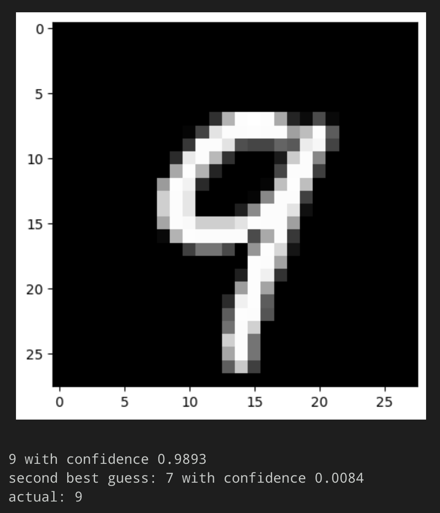

Backpropagation!

Due to the lack of detailed/formal explanations of how the backprop algorithm works, I took inspiration from

> Saeed Damadi, Golnaz Moharrer, & Mostafa Cham. (2023). "The Backpropagation algorithm for a math student."

and implemented it myself in Python.

Right now it offers a few elementary multivariate, multidimensional functions like a linear layer, a ReLU activation,
and Softmax, as well as the Cross Entropy loss and a batch gradient descent optimizer.

The elementary functions use vectorized Numpy operations, but there are still a few places where I use regular Python
loops, so there is still plenty of room for speed improvements.

Of course, however, I had to implement the core optimization that gives backpropagation its name, which is the reuse of
results of earlier stages of the backward pass, such that the algorithm works its way to the front, layer by layer.

The outcomes of the forward pass are cached as well, for use in the backward pass.

I also kept the naive implementation of the computation of the gradient in loss_params_gradient_naive, which is the
result one gets immediately from applying the multivariate chain rule to the composite of the individual layers.

I kept the parameters as simple as I could.

Given a dataset X_train and y_train in numpy array format, I can define my layers, the loss, and my optimizer e.g.:

```
W = np.array([[0, 3], [-2, 1], [1, -1]])
bias = np.array([[1], [-2]])

z_1 = Lin(W, bias)
f_1 = Softmax()
loss = CE()
myoptimizer = BatchGradientDescent(batch_size=5, learning_rate=0.01, epochs=3)
```

Compiling the model, which takes a list of the layers as argument:

```
model = Model(
[z_1, f_1],
loss,
X_train,
y_train,
myoptimizer,
)

model.fit()
```

The model trains and reduces its loss:

```
Epoch 1/3, Batch 1/1, Batch Loss 15.9997: 100%|██████████| 1/1 [00:00<00:00, 1127.80it/s]
Epoch 2/3, Batch 1/1, Batch Loss 15.4395: 100%|██████████| 1/1 [00:00<00:00, 1129.32it/s]
Epoch 3/3, Batch 1/1, Batch Loss 14.8792: 100%|██████████| 1/1 [00:00<00:00, 859.49it/s]
```

Now we can use it to predict:

```
x = np.array([[1], [2], [-1]])
model.predict(x)
```

And we get

```
array([[0.0008],
[0.9992]])
```

which e.g. with an argmax could be made to predict the second class.

## Testing with MNIST digit recognition:

With just 500 data points (images of handwritten digits), tree linear layers of 300, 100 and 10 neurons each, ReLU as
the activation function and Softmax + Cross Entropy loss at the end, I achieve 77% accuracy on classifying the MNIST test
dataset by training for 5 epochs with learning rate 0.05 and batch size 10:

```
$ python3 playground/demo.py
Epoch 1/5, Batch 50/50, Batch Loss 1.8421: 100%|███████████████████████████████████████████████████████████████| 50/50 [01:18<00:00,  1.57s/it]
Epoch 2/5, Batch 50/50, Batch Loss 1.0547: 100%|███████████████████████████████████████████████████████████████| 50/50 [01:18<00:00,  1.56s/it]
Epoch 3/5, Batch 50/50, Batch Loss 0.7434: 100%|███████████████████████████████████████████████████████████████| 50/50 [01:19<00:00,  1.59s/it]
Epoch 4/5, Batch 50/50, Batch Loss 0.5561: 100%|███████████████████████████████████████████████████████████████| 50/50 [01:22<00:00,  1.65s/it]
Epoch 5/5, Batch 50/50, Batch Loss 0.4166: 100%|███████████████████████████████████████████████████████████████| 50/50 [01:19<00:00,  1.60s/it]
Achieved Accuracy: 0.7771
```

This is not a very good result compared to the 95+% accuracy that classifiers are able to achieve on MNIST, however, I
just tried this once without any parameter optimization for a few minutes on my laptop, and for that it seems pretty
decent!
I will have to revisit this in the future and let it run for a little longer...

Running playground/mnist_test.py nicely displays a bunch of images and their predictions after training the model:



